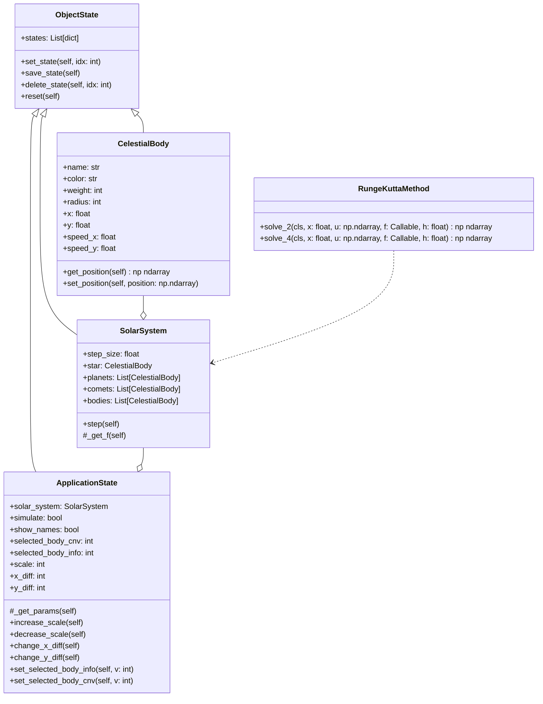
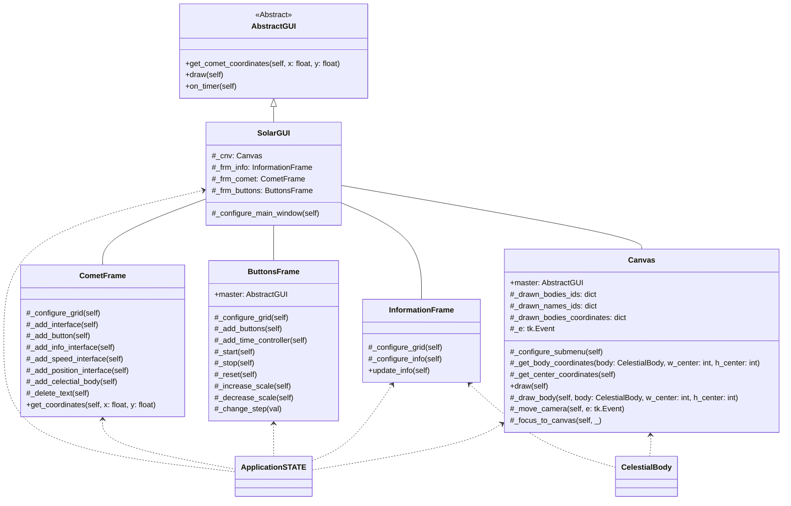

# Solar System

It's a simple simulator of Solar system with all planets and some of their satellites

---

## 1. How to use?

### 1.1 Create a virtual environment

`python3 -m venv ./venv`

### 1.2 Install the requirements

`pip install -r requirements.txt`

### 1.3 Run the simulator

`python3 src/main.py`

## 2. Class diagram

### 2.1 Celestial bodies, application state and Runge-Kutta method

* `ObjectState` - a base class that implements an idea of the object versions by managing its states
* `CelestialBody` - a base class for all celestial bodies
* `SolarSystem` - a base class that describes our Solar system with all planets and implements the `step` method to simulate it 
* `RungeKuttaMethod` - a utility class that solves a system of first-degree differential equations. It's used by `SolarSystem` to solve 
the equations of the `CelestialBody`'s motion
* `ApplicationState` - a base class that stores the complete internal state of the application

### 2.2 Interface

* `AbstractGUI` - an abstract class that describes basic methods for 
* `SolarGUI` - a base class that describes the application interface
* `CometFrame` - a utility class that implements an interface to launch comets
* `ButtonsFrame` - a utility class that implements an interface for basic buttons
* `InformationFrame` - a utility class that implements an interface to show a `CelestualBody`'s information
* `Canvas` - a utility class that displays our Solar system 

Almost all of these classes (except the `AbstractGUI`) use a single global instance of the `ApplicationState` class. In addition, 
`InformationFrame` and `Canvas` classes use an instances of the `CelestialBody` class. 

